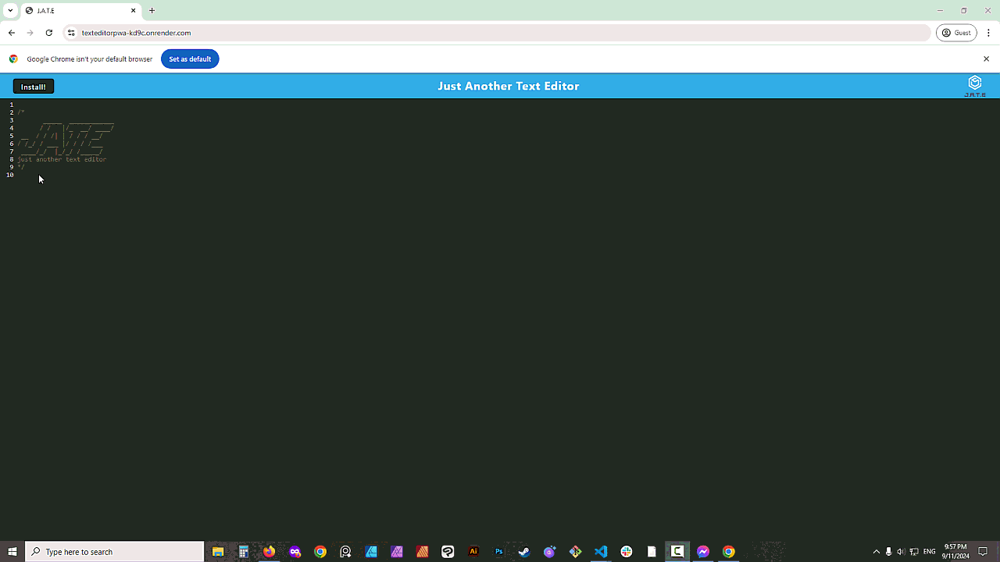

# J.A.T.E.
A simple text editor that runs in the browser, it can be used offline too. 

# Installation 
1. You can go to this website: [Text Editor](https://texteditorpwa-kd9c.onrender.com)

And click on the install button, to install it on your computer. It will save any text you have written in the browser. 

2. You can clone this repo, run ``` npm install ``` on your command line, then run ``` npm start``` to run it on your browser. You can install it in your computer if you click on the *Install* button.

# Mock Up 

# Deployed Application 
[Text Editor](https://texteditorpwa-kd9c.onrender.com)
# Questions 

If you have any questions or want to now more about this project write me to: leena@leenacruz.com